# Spider Fight

Southern stick-fighting circuit. Catch porch orb-weavers, drill them, wager cash, and hold the stick. Lose a bout and the wraps walk off with the other yard — then you train them back.

Playable on phone and desktop. Install it to a Home Screen for an offline-ready yard.

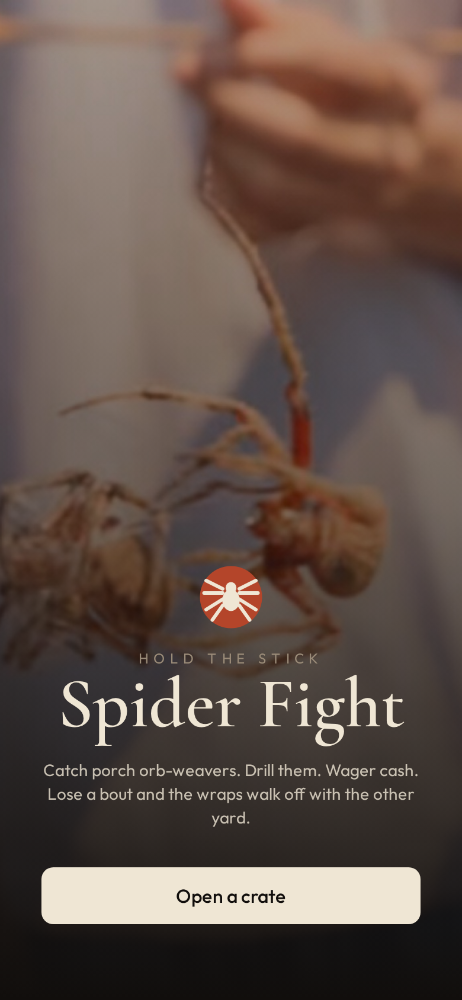

## Look

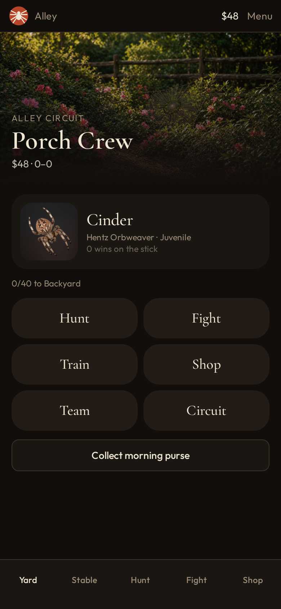

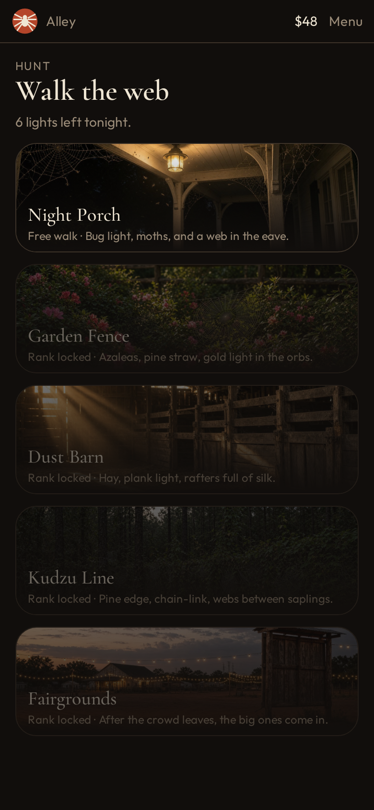

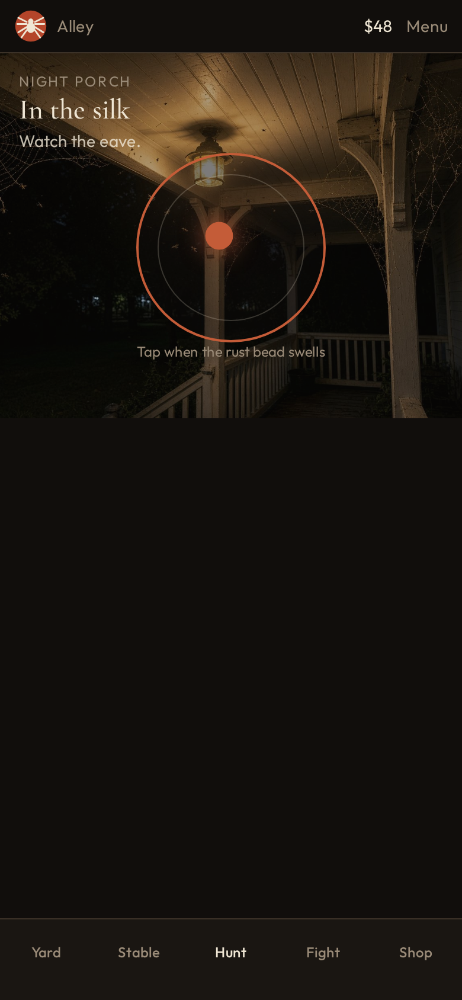

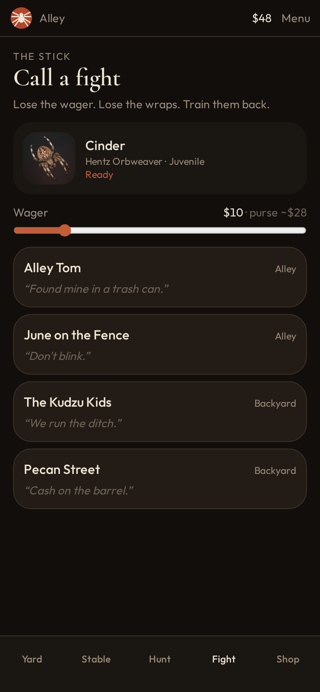

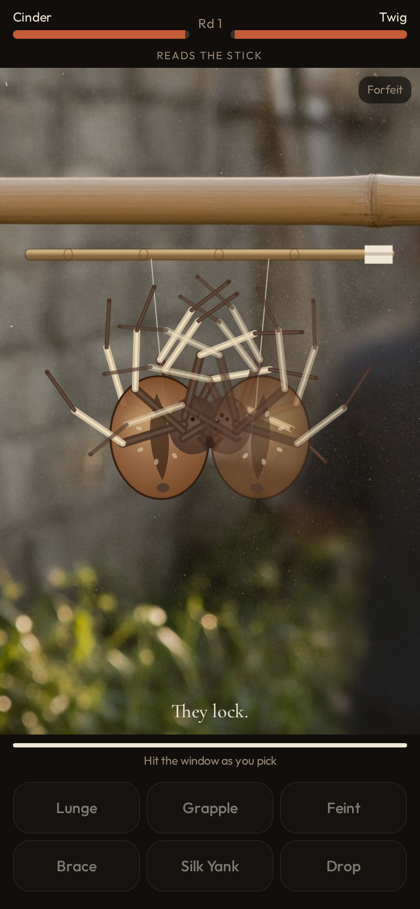

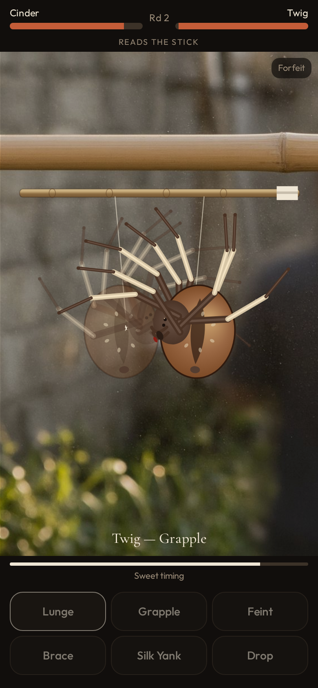

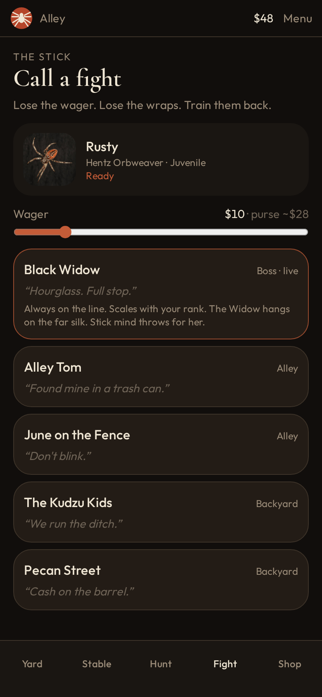

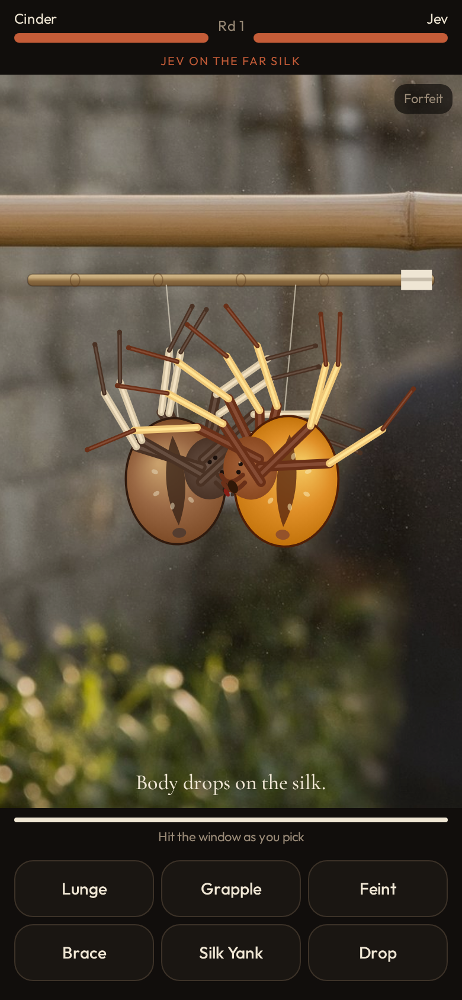

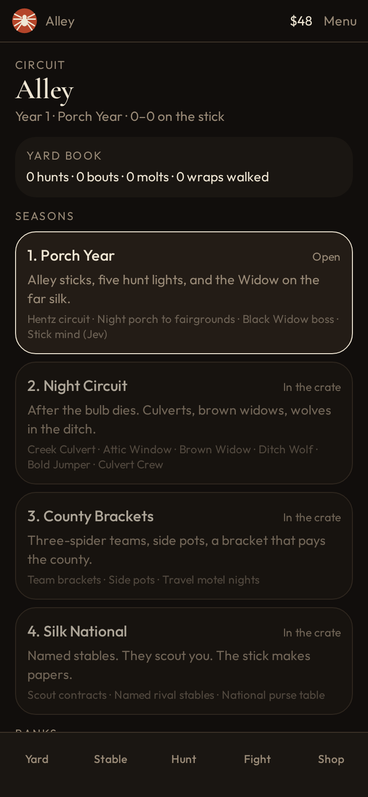

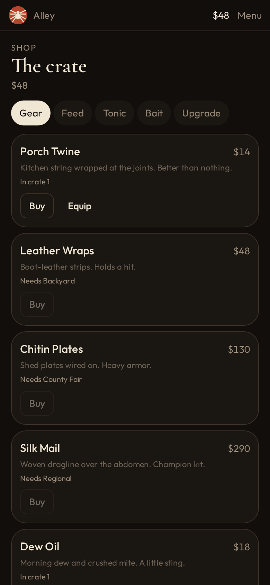

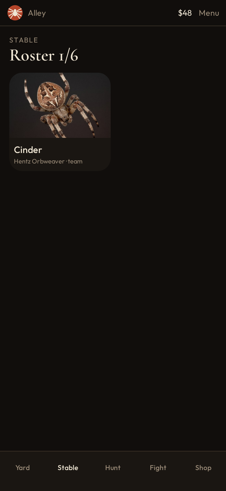

More shots in [`docs/screenshots`](docs/screenshots): train, settings, hunt result, post-fight read.

## What’s in the yard

- **Hunt** six lights a night across porch, garden, barn, woods, fair
- **Stable** of fighters that molt, take injury, lose gear on a drop, and carry bloodlines
- **Species webs** — every spider has a signature move and a distinct charged-web payoff
- **Train / shop / team** — drills change the fighter, and cash buys wraps, fangs, silk, stims, bait
- **Stick fights** — readable, timed counter rounds on a bamboo line (lunge, grapple, feint, brace, yank, drop)
- **Practice Thread** — learn a real opponent's tells with no cash, gear, rank, record, or daily progress at risk
- **Daily loop** — a rotating contract, a species-web challenge, nightly headliner, and three-call Yard Series
- **Circuit** — personal spider scores, web marks, a collection Almanac, and an authenticated shared score board
- **Black Widow** — Shadow Spar her from the first night to learn her tells with no stakes; the ranked call opens at District. Stick mind (Jev) throws for her when `TYPESAFE_API_KEY` is set; local instinct covers if the line is dark

## Run it

```bash
npm install
npm run dev
```

Then open the app. `npm run build` / `npm run typecheck` are the production gates.

## Jev (optional)

Rivals, post-fight reads, and hunt appraisals call [TypeSafe Jev](https://docs.typesafe.ai/introduction). Server-only.

Set `TYPESAFE_API_KEY` in `.env` (no `VITE_` prefix — that would ship the key to the browser):

```
TYPESAFE_API_KEY=apikey_…
```

The repo is public for now, so treat this key as exposed. Rotate it at [console.typesafe.ai/keys](https://console.typesafe.ai/keys) whenever you lock the repo down. For a local override that stays off git, use `.env.local`.

## Growing the circuit

The game is built to get bigger without breaking old yards.

- **Seasons** live in `src/game/catalog.ts` (`SHIPPED_SEASON`). Porch Year through Silk National are live: culverts, brown widows, ditch wolves, jumpers, feed stores, fair pavilions, motel eaves, stadium gates, new gear, and new crews open by rank.
- **Saves migrate.** `src/game/migrate.ts` upgrades old crates, drops unknown items, and maps missing species back to Hentz.
- **Circuit** in the yard shows open packs, coming packs, ranks, and the almanac. Hold World Stick to roll a new year.
- To ship a pack: fill the pack file, then set `SHIPPED_SEASON` to that pack’s id. No save wipe.

## Stack

React 19 · TanStack Start · Vite · Tailwind v4 · Zustand (local save) · Canvas 2D spiders

## License

Personal project. All rights reserved unless noted otherwise.
